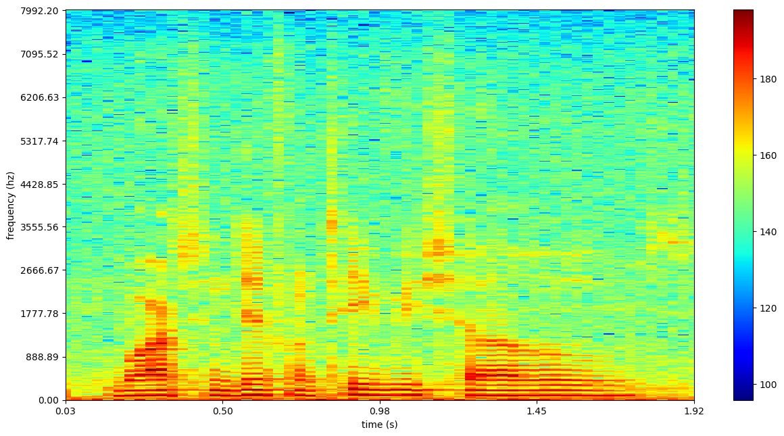
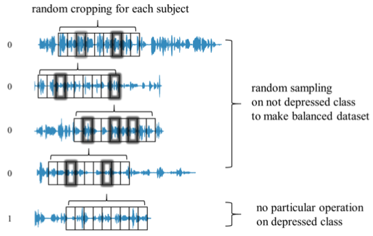

# Detecting Depression From Acoustic Features
An automated device for detecting depression from acoustic features in speech seeks to lower the barrier of entry of seeking help for potential mental illness and reinforce a medical professionals' diagnoses. Early detection and treatment of depression is essential in promoting remission, preventing relapse, and reducing the emotional burden of the disease. Current diagnoses are primarily subjective and early signs of depression are difficult for humans to quantify but have potential to be quantified by machine learning algorithms which could be implemented in a wearable AI device.

For a code walkthrough, see the [src](https://github.com/kykiefer/depression-detect/tree/master/src) folder.

## Table of Contents
1. [Dataset](#dataset)
2. [Acoustic Features of Depressed Speech](#acoustic-features-of-depressed-speech)
    * [Segmentation](#segmentation-code)
    * [Feature Extraction](#feature-extraction-code)
    * [Class Imbalance](#class-imbalance-code)
3. [Convolutional Neural Networks](#convolutional-neural-networks)
    * [Model Architecture](#model-architecture)
    * [Training the Model](#training-the-model)  
    * [Results](#results)
4. [Future Directions](#future-directions)

## Dataset
All audio recordings and associated depression metrics were provided by the [DAIC-WOZ Database](http://dcapswoz.ict.usc.edu/), which was compiled by USC Institute of Creative Technologies and released as part of the 2016 Audio/Visual Emotional Challenge and Workshop ([AVEC 2016](http://sspnet.eu/avec2016/)). The dataset consists of 189 sessions, averaging 16 minutes, between a participant and virtual interviewer called Ellie, controlled by a human interviewer in another room. Prior to the interview, each participant completed a psychiatric questionnaire ([PHQ-8](http://patienteducation.stanford.edu/research/phq.pdf)) from which a binary classification for depression was derived as a truth label for each participant. A transcribed snippet is seen below:

> **Ellie** Who’s someone that’s been a positive influence in your life?

> **Participant** Uh my father.

> **Ellie** Can you tell me about that?

> **Participant** Yeah, he is a uh. He’s a very he’s a man of few words. And uh he's very calm. Slow to anger. And um very warm very loving man. Responsible. And uh he’s a gentleman has a great sense of style and he’s a great cook.


<sub><b>Figure 1: </b> Virtual interview with Ellie. </sub>  

## Acoustic Features of Depressed Speech
While some research focuses on the semantic content of audio signals in predicting depression, I decided to focus on the [prosodic](http://clas.mq.edu.au/speech/phonetics/phonology/intonation/prosody.html) features. Things that are characterized by a listener as of pitch, loudness, speaking rate, rhythm, voice quality, articulation, etc. Some features that have been found to be promising predictors of depression include using short sentences, flat intonation, fundamental frequency, Mel frequency cepstral coefficients ([MFCCs](https://en.wikipedia.org/wiki/Mel-frequency_cepstrum)).<sup>[2](#references)</sup>

### Segmentation ([code](https://github.com/kykiefer/depression-detect/blob/master/src/data/segmentation.py))

The first step in being able to analyze a person's prosodic features of speech is being able to segment the person's speech from silence, other speakers, and noise. Fortunately, the participant's in the DAIC-WOZ study were wearing close proximity microphones and were in low noise environments, which allowed for fairly complete segmentation (84% of interviews) using [pyAudioAnanlysis' segmentation module](https://github.com/tyiannak/pyAudioAnalysis/wiki/5.-Segmentation). When implementing the algorithm in a wearable, [speaker diarisation](https://en.wikipedia.org/wiki/Speaker_diarisation) and background noise removal would obviously have to be extensively explored, but in interest of establishing a minimum viable product, extensive testing and tuning for segmentation robustness was forgone.

### Feature Extraction ([code](https://github.com/kykiefer/depression-detect/blob/master/src/features/spectrograms.py))
There are several ways to approach acoustic feature extraction and this is by far the most critical component to building a successful model within this space. One approach includes extracting short-term and mid-term audio features such as MFCCs, [chroma vectors](https://en.wikipedia.org/wiki/Chroma_feature), [zero crossing rate](https://en.wikipedia.org/wiki/Zero-crossing_rate), etc. and feeding them as inputs to a Support Vector Machine (SVM) or Random Forest. Since pyAudioAnalysis makes short-term feature extraction fairly streamlined, my first go at the problem was building a short-term feature matrix of 50ms audio segments of the [34 short-term features](https://github.com/tyiannak/pyAudioAnalysis/wiki/3.-Feature-Extraction) available from pyAudioAnalysis.

Results...

Many of the state of the art emotion and language detection models seem to be using neural networks. So with limited initial success with an SVM, I wanted to focus my efforts on a convolutional neural network (CNN) and potentially combining it with Long Short Term Memory (LSTM). The most popular way to implement a CNN on audio signals is to provide it with a series of [spectrograms](https://en.wikipedia.org/wiki/Spectrogram). A spectrogram is a visual representation of sound. It displays the amplitude of the frequency components of a signal over time. Understanding spectrograms is critical to moving forward with this project. If interested, I recommend this [video](https://www.youtube.com/watch?v=Gg4IHbiITd0).


<sub><b>Figure 2: </b> Spectrogram of man saying "Watching different TV shows". </sub>  

### Class Imbalance ([code](https://github.com/kykiefer/depression-detect/blob/master/src/features/random_cropping.py))
There exists a large imbalance between positive and negative samples, which incurs a large bias in classification. The number of non-depressed subjects is about four times bigger than that of depressed ones. If these samples are used directly for learning, the model will have a strong bias to the non-depressed class. Additionally, the interview lengths vary from 7-33min. A larger volume of signal may emphasize some characteristics that are person specific.

To solve the problem, I perform random cropping on each of the participant's spectrograms of a specified width (time) and constant height (frequency), to ensure the CNN has an equal proportion for every subject and each class. ELABORATE ONCE FINISHED!!!!!!



<sub><b>Figure 3: </b> Random sampling depicted with audio signals. Actually performed on spectrograms. [Source](https://www.researchgate.net/publication/309127735_DepAudioNet_An_Efficient_Deep_Model_for_Audio_based_Depression_Classification). </sub>  

This random sampling method was entirely inspired by [DepAudioNet: An Efficient Deep Model for Audio based Depression Classification](https://www.researchgate.net/publication/309127735_DepAudioNet_An_Efficient_Deep_Model_for_Audio_based_Depression_Classification).

## Convolutional Neural Networks
Convolutional Neural Networks (CNNs) is a variation of the better known Multilayer Perceptron (MLP) in which nodes connection are inspired by the visual cortex. They have proved a powerful tool in image recognition, video analysis, and natural language processing.

A filter is subsequently slid over an image (in this case a spectrogram) and patterns for depressed and non-depressed individuals are learned. These patterns are representative of different prosodic features.

### Model Architecture
Place holder

### Training the Model
I created the model using [Keras](https://keras.io/) with a [Theano](http://deeplearning.net/software/theano/) backend and trained it on an Amazon Web Services ([AWS](https://aws.amazon.com/)).

### Results
Below is a summary of how well the current model is predicting.

## Future Directions
The model yields promising results...

I envision the model being implemented in a wearable device. The device prompts you to answer a simple question in the morning and a simple question before bed on a daily basis. The model stores your predicted depression score and tracks it over time such that the model can learn from your baseline (perhaps using a Bayesian approach). If a threshold is crossed, it notifies you to seek help, or in extreme cases, notifies an emergency contact to help you help yourself.

I'm currently excited about the results and and will be monitoring pull requests. However, accessing the DAIC-WOZ Database requires signing an agreement form. Access can be granted [here](http://dcapswoz.ict.usc.edu/). To download the 92GB of zip files `cd` into your desired directory and run the following in your shell and follow the [code walkthrough](https://github.com/kykiefer/depression-detect/tree/master/src) to get setup.

```shell
wget -r -np -nH --cut-dirs=3 -R index.html --user=daicwozuser --ask-password  http://dcapswoz.ict.usc.edu/wwwdaicwoz/
```

How I am prioritizing future efforts:
1. Segmentation robustness
2. Incorporate Vocal Tract Length Perturbation ([VTLP](http://www.cs.toronto.edu/~ndjaitly/jaitly-icml13.pdf))
3. Combine CNN with LSTM
4. Refactoring -- the MVP was initially written under a 2-week timeline and much optimization was sacrificed.

## References

    1. Gratch J, Artstein R, Lucas GM, Stratou G, Scherer S, Nazarian A, Wood R, Boberg J, DeVault D, Marsella S, Traum DR. The Distress Analysis Interview Corpus of human and computer interviews. InLREC 2014 May (pp. 3123-3128)
    2. Girard J, Cohn J. Automated Depression Analysis. Curr Opin Psychol. 2015 August; 4: 75–79.
    3. Ma X, Yang H, Chen Q, Huang D, and Wang Y. DepAudioNet: An Efficient Deep Model for Audio based Depression Classification. ACM International Conference on Multimedia (ACM-MM) Workshop: Audio/Visual Emotion Challenge (AVEC), 2016.
