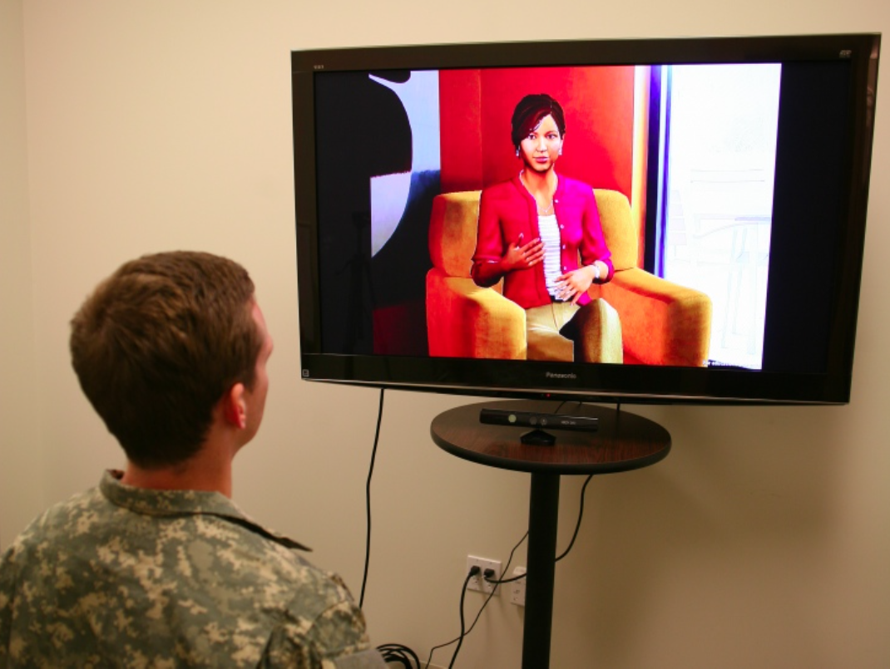
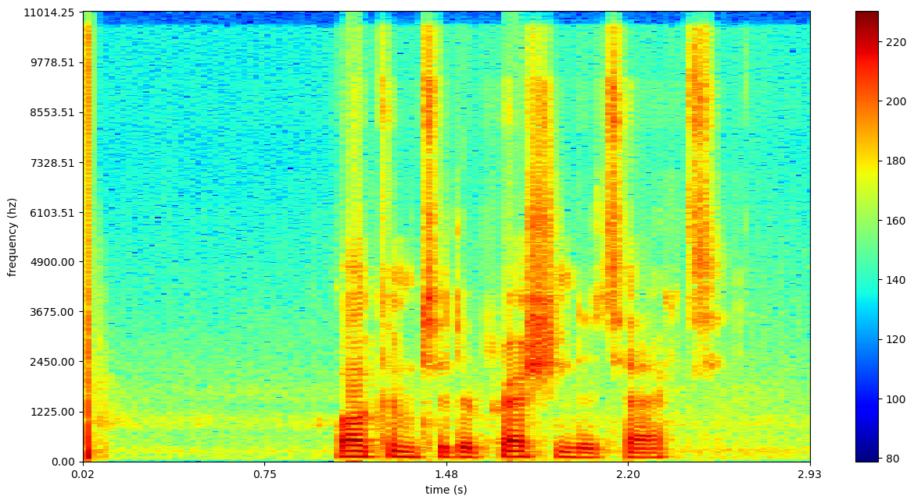
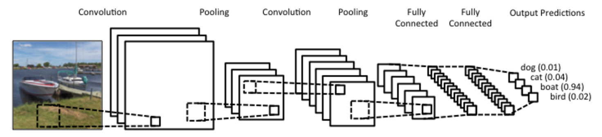
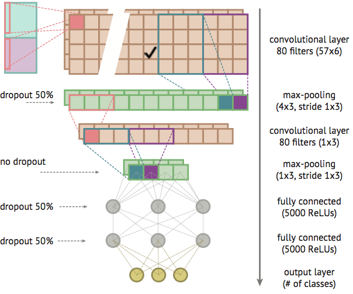
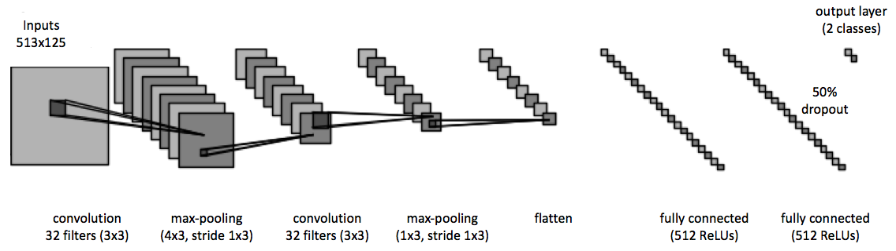
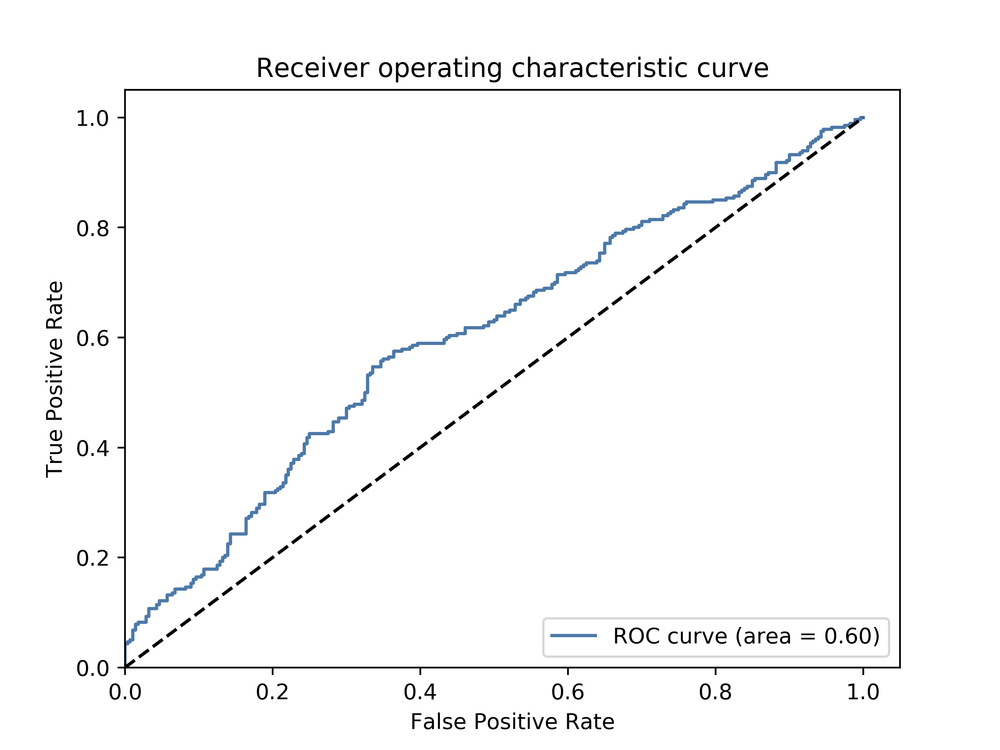
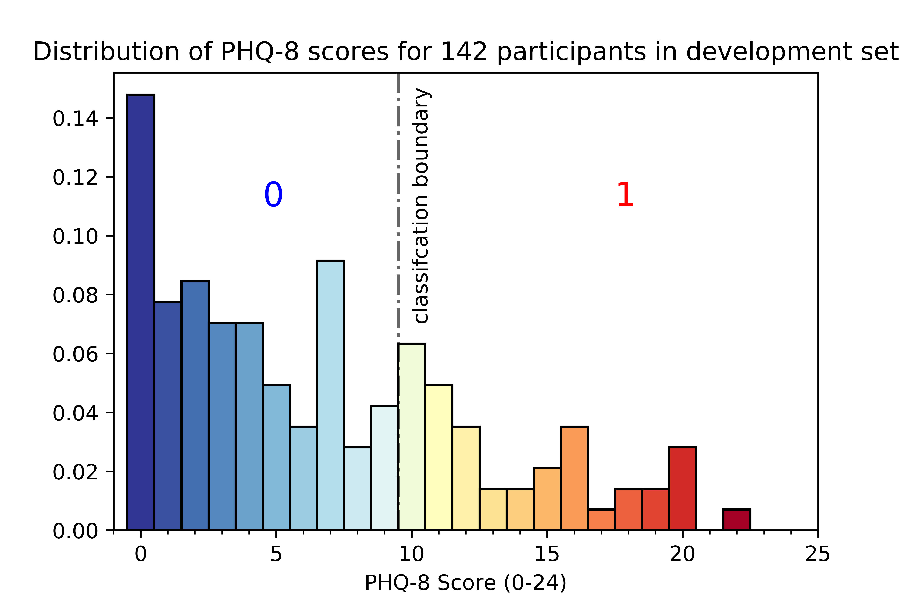

# *DepressionDetect*
This effort addresses an automated device for detecting depression from acoustic features in speech.  The tool is aimed at lowering the barrier of entry in seeking help for potential mental illness and supporting medical professionals' diagnoses.

Early detection and treatment of depression is essential in promoting remission, preventing relapse, and reducing the emotional burden of the disease. Current diagnoses are primarily subjective, inconsistent across professionals, and expensive for the individual who may be in dire need of help. Additionally, early signs of depression are difficult to detect and quantify.  These early signs have a promising potential to be quantified by machine learning algorithms that could be implemented in a wearable artificial intelligence (AI) or home device.


Automatic Depression Detection (ADD) is a relatively nascent topic that first appeared in 2009. *DepressionDetect* presents a novel approach focusing on two aspects that receive scant research attention: class imbalance and data representation (feature extraction).


## Table of Contents
1. [Dataset](#dataset)
2. [Acoustic Features of Speech](#acoustic-features-of-speech)
    * [Segmentation](#segmentation-code)
    * [Feature Extraction](#feature-extraction-code)
3. [Convolutional Neural Networks](#convolutional-neural-networks)
    * [Class Imbalance](#class-imbalance-code)
    * [Model Architecture](#model-architecture-code)
    * [Training the Model](#training-the-model)  
    * [Results](#results)
4. [Donate Your Data](#donate-your-data-code)
5. [Future Directions](#future-directions)

For a code walkthrough, see the [src](https://github.com/kykiefer/depression-detect/tree/master/src) folder.

## Dataset
All audio recordings and associated depression metrics were provided by the [DAIC-WOZ Database](http://dcapswoz.ict.usc.edu/), which was compiled by USC's Institute of Creative Technologies and released as part of the 2016 Audio/Visual Emotional Challenge and Workshop ([AVEC 2016](http://sspnet.eu/avec2016/)). The dataset consists of 189 sessions, averaging 16 minutes, between a participant and virtual interviewer called Ellie, controlled by a human interviewer in another room via a "[Wizard of Oz](https://en.wikipedia.org/wiki/Wizard_of_Oz_experiment)" approach. Prior to the interview, each participant completed a psychiatric questionnaire ([PHQ-8](http://patienteducation.stanford.edu/research/phq.pdf)), from which a binary "truth" classification (depressed, not depressed) was derived.

A representative transcribed interview excerpt is seen below:

> **Ellie:** Who’s someone that’s been a positive influence in your life?

> **Participant:** Uh my father.

> **Ellie:** Can you tell me about that?

> **Participant:** Yeah, he is a uh. He’s a very he’s a man of few words. And uh he's very calm. Slow to anger. And um very warm very loving man. Responsible. And uh he’s a gentleman has a great sense of style and he’s a great cook.



<sub><b>Figure 1: </b> Virtual interview with Ellie. </sub>  

## Acoustic Features of Speech
While some emotion detection research focuses on the semantic content of audio signals in predicting depression, I decided to focus on the [prosodic](http://clas.mq.edu.au/speech/phonetics/phonology/intonation/prosody.html)  features, which have also been found to be promising predictors of depression. Prosodic features can be generally characterized by a listener as pitch, tone, rhythm, stress, voice quality, articulation, intonation, etc. Encouraging features in research include sentence length and rhythm, intonation, fundamental frequency, and Mel-frequency cepstral coefficients ([MFCCs](https://en.wikipedia.org/wiki/Mel-frequency_cepstrum)).<sup>[2](#references)</sup>

### Segmentation ([code](https://github.com/kykiefer/depression-detect/blob/master/src/data/segmentation.py))
The first step in analyzing a person's prosodic features of speech is segmenting the person's speech from silence, other speakers, and noise. Fortunately, the participants in the DAIC-WOZ study were wearing close proximity microphones in low noise environments, which allowed for fairly complete segmentation in 84% of interviews using [pyAudioAnanlysis'](https://github.com/tyiannak/pyAudioAnalysis) segmentation module. When implementing the algorithm in a wearable device, [speaker diarization](https://en.wikipedia.org/wiki/Speaker_diarisation)  (speaker identification) and background noise removal would require further development for a more robust product.  However, in the interest of quickly establishing a minimum viable product, this desired further development was not addressed in the current effort.

### Feature Extraction ([code](https://github.com/kykiefer/depression-detect/blob/master/src/features/spectrograms.py))
There are several ways to approach acoustic feature extraction, which is the most critical component to building a successful approach. One method includes extracting short-term and mid-term audio features such as MFCCs, [chroma vectors](https://en.wikipedia.org/wiki/Chroma_feature), [zero crossing rate](https://en.wikipedia.org/wiki/Zero-crossing_rate), etc. and feeding them as inputs to a Support Vector Machine (SVM) or Random Forest. Since pyAudioAnalysis makes short-term feature extraction fairly streamlined, my first approach to this classification problem involved building short-term feature matrices from 50ms audio segments of the [34 short-term features](https://github.com/tyiannak/pyAudioAnalysis/wiki/3.-Feature-Extraction) available from pyAudioAnalysis.  Since these features are lower level representations of audio, the concern arises that subtle speech characteristics displayed by depressed individuals would go undetected.

Running a Random Forest on the 34 short-term features yielded an encouraging [F1 score](https://en.wikipedia.org/wiki/F1_score) of `0.59`, with minimal tuning. This approach has been previously employed by others, so I treated this as "baseline" comparative data for which to develop and evaluate a completely new approach involving convolutional neural networks (CNNs) with spectrograms, which I felt could be quite promising and powerful.

CNNs require a visual image. In this effort, speech stimuli is represented via a [spectrogram](https://en.wikipedia.org/wiki/Spectrogram). A spectrogram is a visual representation of sound, displaying the amplitude of the frequency components of a signal over time. Unlike MFCCs and other transformations that represent lower level features of sound, spectrograms maintain a high level of detail (including the noise, which can present challenges to neural network learning).

An example of a spectrogram input to the CNN is shown in Figure 2.

<sub>**Technical note:** The spectrograms are generated through a short-time Fourier transform (STFT). STFT is a short-term processing technique that breaks the signals possibly overlapping frames using a moving window technique and computes the Discrete Fourier Transform (DFT) at each frame.<sup>[4](#references)</sup> It should be noted that the trade-off between frequency and time resolution was not extensively explored in this effort, which assumed a Hann window with a window length of 513.</sub>



<sub><b>Figure 2: </b> Spectrogram of a [plosive](http://www.soundonsound.com/sound-advice/q-how-can-i-deal-plosives), followed by a second of silence, and the spoken words, "Welcome to *DepressionDetect*". </sub>  

## Convolutional Neural Networks
Convolutional neural networks (CNNs) are a variation of the better known Multilayer Perceptron (MLP) in which node connections are inspired by the visual cortex.  CNNs have proven to be a powerful tool in image recognition, video analysis, and natural language processing. More germane to the current effort, successful applications have also been applied to speech analysis.

Below is a quick primer to CNNs in the context of my project. For readers interested in more information, this [video](https://www.youtube.com/watch?v=FmpDIaiMIeA) and Stanford's [CS231 course](http://cs231n.github.io/convolutional-networks/) are recommended.



<sub><b>Figure 3: </b> General CNN architecture. </sub>

CNNs take images as input. In the case of the spectrogram, I pass (or input) a grayscale representation, with the "grayness" representative of the audio power level at that specific frequency and time. A filter (kernel) is subsequently slid over the spectrogram image and patterns for depressed and non-depressed individuals are learned (based on the aforementioned "truth" dataset).

The CNN begins by learning features like vertical lines, but in subsequent layers, begins to pick up on features like the shape of frequency-time curve (perhaps representative of speaker intonation). Such learned features may provide an elegant and powerful representation of different prosodic features of speech, which in turn are representative of underlying differences between depressed and non-depressed speech.

However, with the highly detailed representations of speech provided in spectrograms, false noise signals (ambient noise, plosives, unsegmented audio from other speakers, etc.) can be inconveniently picked up by the network. One can mitigate this noise with different regularization parameters in the network (pooling layers, L1 loss functions, dropout, etc.), but unless your training data is abundant, it is challenging for the network to distinguish real predictors of depression from the false signal.

### Class Imbalance ([code](https://github.com/kykiefer/depression-detect/blob/master/src/features/random_sampling.py))
In the current dataset, the number of non-depressed subjects is about four times larger than that of depressed ones, which can introduce a classification "non-depressed" bias. Additional bias can occur due to the considerable range of interview durations from 7-33 minutes because a larger volume of signal from an individual may emphasize some characteristics that are person specific.

In an attempt to address these issues, each of the participant's segmented spectrograms were cropped into 4-second slices. Next, participants were randomly sampled in 50/50 proportion from each class (depressed, not depressed). Then, a fixed number of slices were sampled from each of the selected participants to ensure the CNN has an equal interview duration for each participant. This drastically reduced the training dataset size to 3 hours from the original 35 hours of segmented audio, which was felt adequate for this exploratory analysis.

It should be noted a few different sampling methods were explored to try to increase the size of the training data, and all resulted in highly biased models in which only the "non-depressed" class was predicted. A revised sampling method should be considered as high-priority in future directions (e.g. see [interesting sampling method](https://www.researchgate.net/publication/309127735_DepAudioNet_An_Efficient_Deep_Model_for_Audio_based_Depression_Classification)) to increase the training sample size.

<sup>**6/21/2017 update:** The need for class balancing on binary classification problems, where class probabilities are assigned by the model, is somewhat disputed. See questions posed on Cross Validated [[1](https://stats.stackexchange.com/questions/283170/when-is-unbalanced-data-really-a-problem-in-machine-learning), [2](https://stats.stackexchange.com/questions/247871/what-is-the-root-cause-of-the-class-imbalance-problem)].</sup>

### Model Architecture ([code](https://github.com/kykiefer/depression-detect/blob/master/src/features/cnn.py))
A 6-layer convolutional neural network (CNN) model was employed consisting of 2 convolutional layers with max-pooling and 2 fully connected layers. Each spectrogram input is an image with dimension 513x125 representing 4 seconds of audio and frequencies ranging from 0 to 8kHz. The frequency range was tuned as a hyperparameter, since most human speech energy is concentrated between 0.3-3kHz. Each input is normalized according to decibels relative to full scale (dBFS).

Though there are some differences, the actual architecture employed in this effort was largely inspired by a paper on Environmental Sound Classification with CNNs.<sup>[5](#references)</sup> The network architecture employed in this paper is shown in Figure 4, with *DepressionDetect's* architecture displayed in Figure 5.



<sub><b>Figure 4: </b> Environmental Sound Classification CNN architecture. </sub>



<sub><b>Figure 5: </b> *DepressionDetect* CNN architecture. </sub>

The CNN used here begins with an input layer being convolved with 32-3x3 filters to create 32 feature maps followed by a ReLU activation function. Next, the feature maps undergo dimensionality reduction with a max-pooling layer, which uses a 4x3 filter with a stride of 1x3.

A second similar convolutional layer is employed with 32-3x3 filters followed by a max-pooling layer with a 1x3 filter and stride of 1x3.

This layer is then followed by two dense layers. After the second dense layer, a dropout layer of 0.5 is used (meaning each neuron in the second dense layer has a 50% chance of turning off after each batch update).

Lastly, a softmax function is applied, which returns the probability that a spectrogram is in the depressed class or not depressed class. The sum probabilities of each class is equal to 1.
A batch size of 32 (out of 2480 spectrograms) was used along with an Adadelta optimizer, which dynamically adapts the learning rate based on the gradient.

### Training the Model
I created the model using [Keras](https://keras.io/) with a [Theano](http://deeplearning.net/software/theano/) backend and trained it on an AWS GPU-optimized EC2 instance.

The model was trained on 40 randomly selected 513x125 (frequency x time bins) audio segments from 31 participants in each category of depression (resulting in 2,480 spectrograms in total). This is representative of just under 3 hours of audio in order to adhere by strict class (depressed, not depressed) and speaker balancing (160 seconds per subject) parameters. The model was trained for 7 epochs, after which it was observed to overfit based on train and validation loss curves.

### Results
I assessed my model and tuned my hyperparameters based on [AUC score](https://en.wikipedia.org/wiki/Receiver_operating_characteristic#Area_under_the_curve) and F1 score on a training and validation set. AUC scores are commonly used to evaluate emotion detection models, because precision and recall can be misleading if test sets have unbalanced classes (although they were balanced with this approach).

The test set (which is distinct from the train and validation sets used to develop the model) was composed of 560 spectrograms from 14 participants (40 spectrograms per participant, totaling 160 seconds of audio). Initially, predictions were made on each of the 4-second spectrograms, to explore the extent to which depression can be detected from 4-second audio segments. Ultimately, a majority vote of the 40 spectrogram predictions per participant was utilized to classify the participant as depressed or not depressed.

Table 1 provides a summary of the predictive power using 4-second spectrograms with Table 2 using the "majority vote" approach.

**Table 1:** Test set predictions on 4-second spectrograms

|  Confusion Matrix | Actual: Yes | Actual: No |
|:----------------:| :-------:| :------:|
| **Predicted: Yes**  | 174 (TP) | 106 (FP) |
| **Predicted: No**   | 144 (FN) | 136 (TN) |

| F1 score | precision | recall | accuracy |
|:--------:| :--------:| :-----:| :-------:|
| 0.582    | 0.621     | 0.547  | 0.555    |




<sub><b>Figure 6: </b> ROC curve of the CNN model. </sub>

As stated above, a majority vote across the 40 spectrograms per participant was also explored as a means to predict each participant’s depression category. However, only 14 users were contained in the test set (in order to maximize the training data), so I wanted to be sure to include statistics on individual spectrogram predictions as well as the majority vote approach. As might be expected, model evaluation statistics improved somewhat when taking a majority vote. However, the sample size is quite small.

**Table 2:** Test set predictions using majority vote

|  Confusion Matrix | Actual: Yes | Actual: No |
|:----------------:| :-------:| :------:|
| **Predicted: Yes**  | 4 (TP) | 2 (FP) |
| **Predicted: No**   | 3 (FN) | 5 (TN) |

| F1 score | precision | recall | accuracy |
|:--------:| :--------:| :-----:| :-------:|
| 0.615    | 0.667     | 0.571  | 0.643    |

State of the emotion detection models exhibit AUC scores `~0.7` (my model had an AUC score of `0.58`), utilizing the lower level features alluded to. Although, this rapidly developed model is not yet at a predictive state for practical usage "as is", these results strongly suggest a promising, new direction for using spectrograms in depression detection.

## Donate Your Data ([code](https://github.com/kykiefer/depression-detect/tree/master/web_app))
The model needs your help! Detecting depression is *hard*. Robust speech recognition models rely on hundreds of hours of audio data. The good news is that *you* can contribute! Visit [DataStopsDepression.com](http://www.datastopsdepression.com/) to become a *data donor*! Your audio data will be incorporated in periodic model re-training with a batch algorithm.

The donation process:
1. Record a 40-second anonymized clip of yourself reading a provided paragraph and see a cool spectrogram of your audio recording!
2. You will be prompted to complete an 8 question psychiatric survey.

The [Flask](http://flask.pocoo.org/) app is hosted on an [AWS EC2](https://aws.amazon.com/ec2/) instance utilizing [S3](https://aws.amazon.com/s3/) for storage. The donation process is illustrated step-by-step in Figure 7 below.

<kbd>
  
</kbd>

<sub><b>Figure 7: </b> [DataStopsDepression.com](http://www.datastopsdepression.com/) donation process. </sub>  

## Future Directions
I ultimately envision the model being implemented in a wearable device (Apple Watch, Garmin) or home device (Amazon Echo). The device could prompt you to answer a simple question in the morning and a simple question before bed on a daily basis. The model stores your predicted depression score and tracks it over time, such that the model can learn from your baseline (perhaps using a Bayesian approach). If a threshold is crossed, it notifies you to seek help, or in extreme cases, notifies an emergency contact to help you help yourself.

This initial model provides a solid foundation and promising directions for detecting depression with spectrograms. Further work should train in more speakers. Low level audio transformations do a good job of reducing the noise in the data, which allows for robust models to be trained on smaller sample sizes. However, I still hypothesize they overlook subtleties in depressed speech.

I would prioritize future efforts as follows:
1. Sampling methods to increase training size without introducing class or speaker bias.
2. Treating depression detection as a regression problem (see below).
3. Introducing network recurrence ([LSTM](http://blog.echen.me/2017/05/30/exploring-lstms/)).
4. Incorporate Vocal Tract Length Perturbation ([VTLP](http://www.cs.toronto.edu/~ndjaitly/jaitly-icml13.pdf)).

Depression moves across a spectrum, so deriving a binary classification (depressed, not depressed) from a single test (PHQ-8) is somewhat naïve and perhaps unrealistic. The threshold for a depression classification was a score of 10, but how much difference in depression-related speech prosody exists between a score of 9 (classified as not depressed) and a 10 (classified as depressed)? For this reason, the problem may be better approached by using regression techniques to predict participants' PHQ-8 scores and scoring the model based on [RMSE](https://en.wikipedia.org/wiki/Root-mean-square_deviation).



<sub><b>Figure 8: </b> Distribution of PHQ-8 scores. </sub>

I'm currently excited about the results and will be monitoring pull requests. However, accessing the DAIC-WOZ Database requires signing an agreement form, which can be found [here](http://dcapswoz.ict.usc.edu/). To download the 92GB of zip files `cd` into your desired directory and run the following in your shell. Follow the [code walkthrough](https://github.com/kykiefer/depression-detect/tree/master/src) to get set up for analysis.

```shell
wget -r -np -nH --cut-dirs=3 -R index.html --user=daicwozuser --ask-password  http://dcapswoz.ict.usc.edu/wwwdaicwoz/
```

## Tech Stack


## References
    1. Gratch, Artstein, Lucas, Stratou, Scherer, Nazarian, Wood, Boberg, DeVault, Marsella, Traum. The Distress Analysis Interview Corpus of human and computer interviews. InLREC 2014 May (pp. 3123-3128).
    2. Girard, Cohn. Automated Depression Analysis. Curr Opin Psychol. 2015 August; 4: 75–79.
    3. Ma, Yang, Chen, Huang, and Wang. DepAudioNet: An Efficient Deep Model for Audio based Depression Classification. ACM International Conference on Multimedia (ACM-MM) Workshop: Audio/Visual Emotion Challenge (AVEC), 2016.
    4. Giannakopoulos, Aggelos. Introduction to audio analysis: a MATLAB approach. Oxford: Academic Press, 2014.
    5. Piczak. Environmental Sound Classification with Convolutional Neural Networks. Institute of Electronic System, Warsaw University of Technology, 2015.

## Code References
    1. http://yerevann.github.io/2015/10/11/spoken-language-identification-with-deep-convolutional-networks
    2. http://www.frank-zalkow.de/en/code-snippets/create-audio-spectrograms-with-python.html
