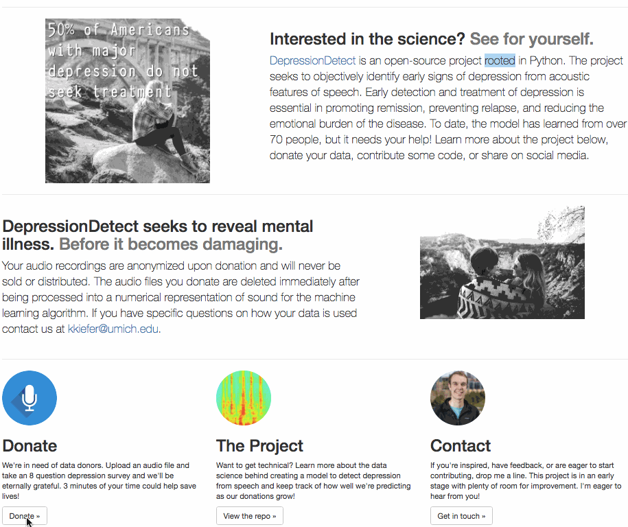

# DonateYourData

The [Flask](http://flask.pocoo.org/) app is hosted on an [AWS EC2](https://aws.amazon.com/ec2/) instances utilizing [S3](https://aws.amazon.com/s3/) for storage. The audio data uploaded by users is incorporated in periodic model re-training with a batch algorithm. Check it out at [www.DataStopsDepression.com](www.DataStopsDepression.com).

<b>Figure 1: </b> [DataStopsDepression.com](www.datastopsdepression.com) donation process.   
